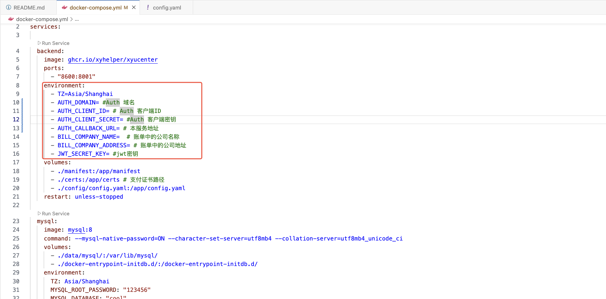
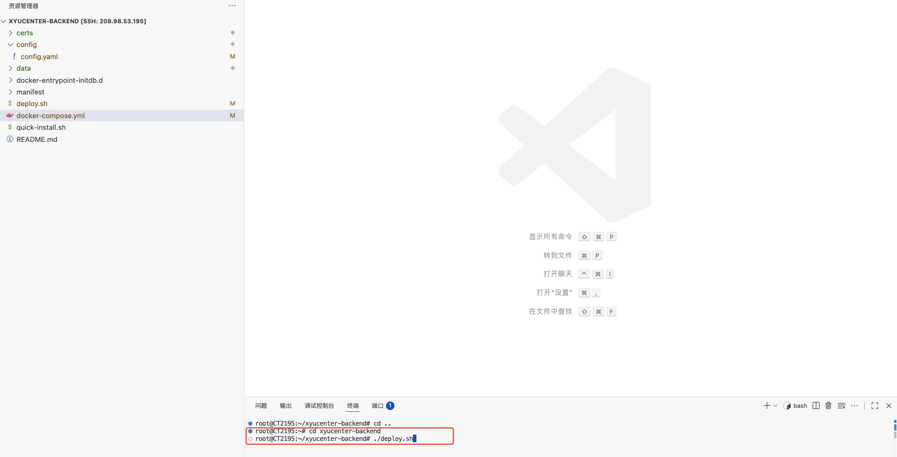

# xyucenter-Deploy

xyucenter 快速部署脚本库


## 前置条件
- 本项目为商业服务,依赖于`xyhelper.cn`提供的接入点服务运行
- 一台至少 2 核 2G 内存的服务器,推荐使用香港、新加坡、日本地区的服务器,可以兼顾国内访问。
- 安装了 docker 和 docker-compose
- 安装了 git


## 自动部署

在服务器上执行以下命令即可

```bash
curl -sSfL https://raw.githubusercontent.com/xyhelper/xycenter-deploy/master/quick-install.sh | bash

```

## 手动部署

1. 克隆本仓库到服务器上

```bash
git clone --depth=1 https://github.com/xyhelper/xyucenter-deploy.git xyucenter-backend
```

2. 进入目录

```bash
cd xyucenter-backend
```

3. 启动服务

```bash
./deploy.sh
```

## 图文部署

1. 克隆xyucenter-deploy仓库到服务器上，使用vscode连接上远程服务器，然后选择克隆项目，输入下面git clone命令
   git clone --depth=1 https://github.com/xyhelper/xyucenter-deploy.git xyucenter-backend
   

2. 项目克隆之后，打开该项目，打开之后如下图所示，打开docker-compose.yml，修改环境变量
   

3. 配置AUTH0参数，找到backend服务下面的environment
   修改AUTH0_DOMAIN、AUTH0_CLIENT_ID、AUTH0_CLIENT_SECRET的参数值，具体数据从auth0中获取，登录https://auth0.com/
   注册应用之后，点击Applications中应用，然后找到配置信息,替换你自己的Auth0的域名，客户端ID以及客户端密钥
   
   
   服务的访问域名地址确定之后，修改AUTH0_CALLBACK_URL值，设置AUTH0允许回调地址
   将中心回调地址和子应用回调地址配置在Allowed Callback URLs和Allowed Logout URLs上
   中心回调地址：AUTH0_CALLBACK_URL/api/v1/center/getToken
   子应用回调地址：AUTH0_CALLBACK_URL/auth0/callback
   

4. 配置账单中的公司信息和子应用的JWT秘钥
   BILL_COMPANY_NAME      公司名称
   BILL_COMPANY_ADDRESS   公司地址
   JWT_SECRET_KEY         jwt密钥

5. 配置项目服务，mysql和redis的端口号
   
   
   

6. 挂载支付证书
   在项目根目录创建certs/alipay和certs/wechatpay目录，将支付宝证书和微信支付证书放入，微信支付采用v3版本，秘钥使用.pem格式
   

7. 修改config/config.yaml文件中的支付配置
   其中wechat_pay（微信支付）notify_url（回调地址）配置：服务域名地址/api/v1/payment/wechat/callback
      alipay_pay (支付宝支付) notify_url（回调地址）配置：服务域名地址/api/v1/payment/alipay/callback
      alipay_pay (支付宝支付) return_url（支付成功回调页面）配置：服务域名地址/xyucenter/#/userOrders
   

8. 保证config/config.yaml文件中的服务端口、mysql端口、redis端口与第5步骤中的服务中的端口一致
   
   

9. 命令终端，输入cd xyucenter-backend进入到项目中，再执行./deploy.sh，启动项目
   


## 使用方法

用户端访问地址为 http://服务器 ip:8001

用户中心地址为 http://服务器 ip:9000/xyucenter

管理后台地址为 http://服务器 ip:9000/xyhelper/

默认用户名密码为 admin/123456


